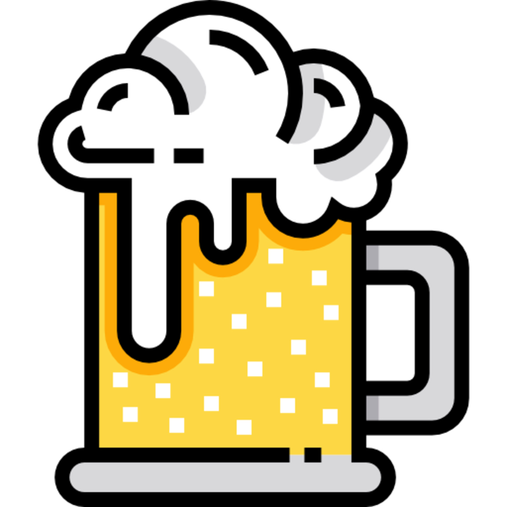
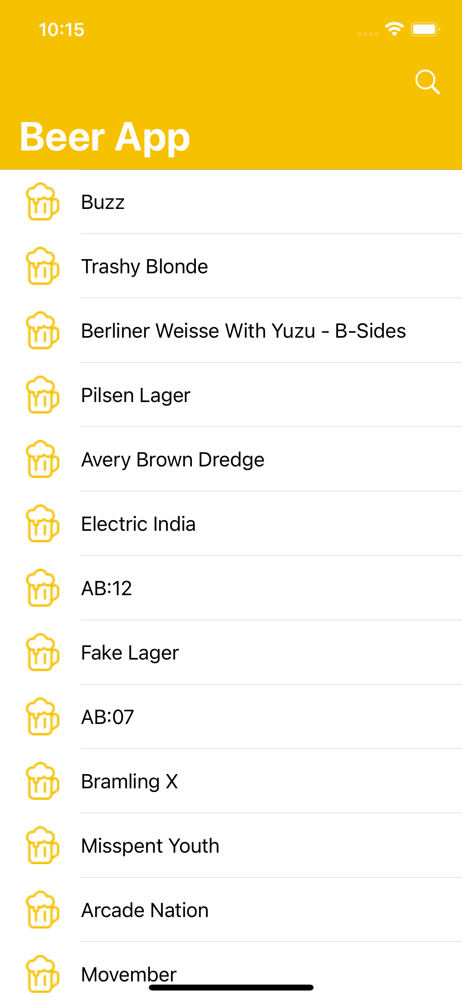
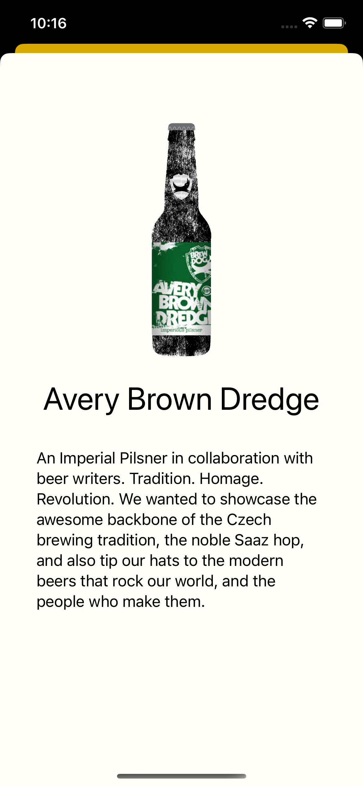

 

    

  <h3 align="center">O2O Beer App</h3>

  

    An iOS app to search for beers using <a href="https://punkapi.com/documentation/v2"> PunkApi</a>
  

<!-- ABOUT THE PROJECT -->

# About The Project

    This app has been made as a challenge of the Technical Test of MO2O. In the app you can search for beers that match
    an specific food and view a detailed screen with more information about that beer. Currently it only shows the beer image, the name and the description, but it can easily be changed to satisfy future needs. 

<!-- ACKNOWLEDGMENTS -->

## Acknowledgments

Tools used in this project:

- [Choose an Open Source License](https://choosealicense.com)
- [Flaticon](https://www.flaticon.es)

## License

Distributed under the GPL License. See `LICENSE.txt` for more information.
